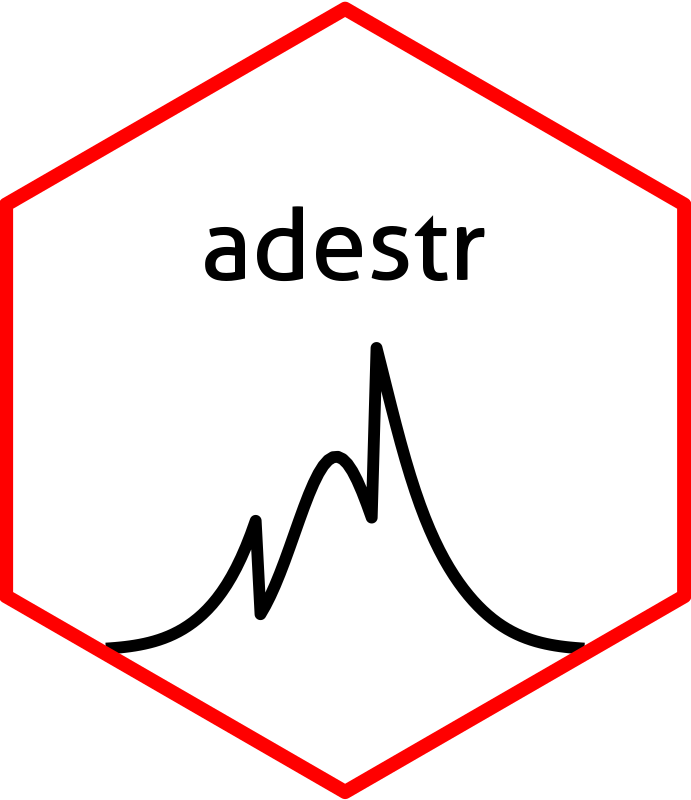

<!-- README.md is generated from README.Rmd. Please edit that file -->

```{r, include = FALSE}
knitr::opts_chunk$set(
  collapse = TRUE,
  comment = "#>",
  fig.path = "man/figures/README-",
  out.width = "100%"
)
```

# adestr <a href='https://github.com/jan-imbi/adestr'></a>

<!-- badges: start -->
[](https://github.com/jan-imbi/adestr/actions/workflows/R-CMD-check.yaml)
[](https://app.codecov.io/gh/jan-imbi/adestr?branch=master)
[](https://github.com/jan-imbi/adestr/blob/master/LICENSE.md)
<!-- badges: end -->


This package implements methods to evaluate the performance characteristics
of various point and interval estimators for adaptive two-stage designs with 
prespecified sample-size recalculation rules. Further, it allows for
evaluation of these estimators on real datasets, and it implements methods
to calculate p-values.

Currently, it works for designs objects which were produced by the
R-package `adoptr`, which calculates optimal design parameters adaptive
two-stage designs.

## Installation

You can install the development version of adestr by typing

```{r, eval=FALSE}
remotes::install_github("https://github.com/jan-imbi/adestr")
```
into your R console.

## Information for reviewers

The scripts to reproduce the results from the paper can be found in the
`/data/code/` directory of this repository. The results themselves are
located in the `/data/` directory.

The easiest way to inspect the results is to [clone this repository](https://docs.github.com/en/repositories/creating-and-managing-repositories/cloning-a-repository).


## General example for usage of the package

Here is a quick example showing the capabilities of `adestr`.
First, load `adestr`:

```{r}
library(adestr)
```

Then, you can evaluate the performance of an estimator like this:

```{r}
evaluate_estimator(
 score = MSE(),
 estimator = SampleMean(),
 data_distribution = Normal(two_armed = TRUE),
 design = get_example_design(),
 mu = c(0, 0.3, 0.6),
 sigma = 1
)

evaluate_estimator(
 score = MSE(),
 estimator = SampleMean(),
 data_distribution = Normal(two_armed = TRUE),
 design = get_example_design(),
 mu = seq(-0.7, 1.5, .05),
 sigma = 1
) |> 
  plot()
```

You can analyze a dataset like this:

```{r}
set.seed(321)
dat <- data.frame(
 endpoint = c(rnorm(28, .2, 1), rnorm(28, 0, 1),
              rnorm(23, .2, 1), rnorm(23, 0, 1)),
 group = factor(rep(c("ctl", "trt", "ctl", "trt"),
                    c(28,28,23,23))),
 stage = rep(c(1L, 2L), c(56, 46))
)
analyze(
 data = dat,
 statistics = get_example_statistics(),
 data_distribution = Normal(two_armed = TRUE),
 sigma = 1,
 design = get_example_design()
)
```
