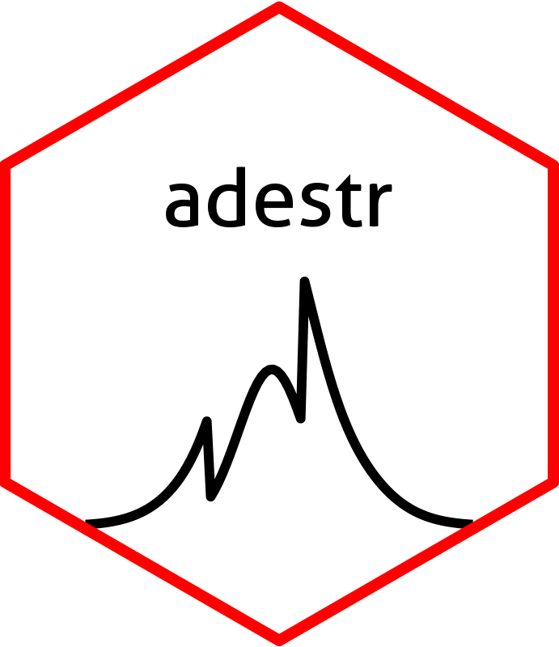

<!-- README.md is generated from README.Rmd. Please edit that file -->

# adestr <a href='https://github.com/jan-imbi/adestr'></a>

<!-- badges: start -->

[](https://github.com/jan-imbi/adestr/actions/workflows/R-CMD-check.yaml)
[](https://app.codecov.io/gh/jan-imbi/adestr?branch=master)
[](https://github.com/jan-imbi/adestr/blob/master/LICENSE.md)
<!-- badges: end -->

This package implements methods to evaluate the performance
characteristics of various point and interval estimators for adaptive
two-stage designs with prespecified sample-size recalculation rules.
Further, it allows for evaluation of these estimators on real datasets,
and it implements methods to calculate p-values.

Currently, it works for designs objects which were produced by the
R-package `adoptr`, which calculates optimal design parameters adaptive
two-stage designs.

## Installation

You can install the development version of adestr by typing

``` r
remotes::install_github("https://github.com/jan-imbi/adestr")
```

into your R console.

## Information for reviewers

The scripts to reproduce the results from the paper can be found in the
`/data/code/` directory of this repository. The results themselves are
located in the `/data/` directory.

The easiest way to inspect the results is to [clone this
repository](https://docs.github.com/en/repositories/creating-and-managing-repositories/cloning-a-repository).

## General example for usage of the package

Here is a quick example showing the capabilities of `adestr`. First,
load `adestr`:

``` r
library(adestr)
#> Loading required package: adoptr
```

Then, you can evaluate the performance of an estimator like this:

``` r
evaluate_estimator(
 score = MSE(),
 estimator = SampleMean(),
 data_distribution = Normal(two_armed = TRUE),
 design = get_example_design(),
 mu = c(0, 0.3, 0.6),
 sigma = 1
)
#> Design:                               TwoStageDesign<n1=28;0.8<=x1<=2.3:n2=9-40>
#> Data Distribution:                                             Normal<two-armed>
#> Estimator:                                                           Sample mean
#> Assumed sigma:                                                                 1
#> Assumed mu:                                                          0.0 0.3 0.6
#> Results:
#>  Expectation:                                -0.03523827  0.28169661  0.63556746
#>  Bias:                                       -0.03523827 -0.01830339  0.03556746
#>  Variance:                                      0.05558910 0.07330464 0.06591361
#>  MSE:                                           0.05683084 0.07363966 0.06717865

evaluate_estimator(
 score = MSE(),
 estimator = SampleMean(),
 data_distribution = Normal(two_armed = TRUE),
 design = get_example_design(),
 mu = seq(-0.7, 1.5, .05),
 sigma = 1
) |> 
  plot()
```


You can analyze a dataset like this:

``` r
set.seed(321)
dat <- data.frame(
 endpoint = c(rnorm(28, .2, 1), rnorm(28, 0, 1),
              rnorm(23, .2, 1), rnorm(23, 0, 1)),
 group = factor(rep(c("ctl", "trt", "ctl", "trt"),
                    c(28,28,23,23))),
 stage = rep(c(1L, 2L), c(56, 46))
)
analyze(
 data = dat,
 statistics = get_example_statistics(),
 data_distribution = Normal(two_armed = TRUE),
 sigma = 1,
 design = get_example_design()
)
#> Design:                               TwoStageDesign<n1=28;0.8<=x1<=2.3:n2=9-40>
#> Data Distribution:                                             Normal<two-armed>
#> Observed number of stages:                                                     2
#> Observed n1 (group 1)                                                         28
#> Observed n1 (group 2)                                                         28
#> Observed n1 (total)                                                           56
#> Z1                                                                          1.75
#> Interim decision:                                       continue to second stage
#> Calculated n2(Z1) (per group)                                                 23
#> Calculated c2(Z1)                                                           1.14
#> Observed n2 (group 1)                                                         23
#> Observed n2 (group 2)                                                         23
#> Observed n2 (in total)                                                        46
#> Z2                                                                          2.12
#> Final test decision:                                                 reject null
#> 
#> Stage 2 results:
#>  Sample mean:                                                          0.5389012
#>  Pseudo Rao-Blackwellized:                                             0.3632916
#>  Median unbiased (LR test ordering):                                   0.5069941
#>  Bias reduced MLE (iterations=1):                                      0.5253743
#>  SWCF ordering CI:                                       [0.06264641, 0.7431231]
#>  LR test ordering CI:                                       [0.2504091, 0.81829]
#>  SWCF ordering p-value:                                               0.01097483
#>  LR test ordering p-value:                                          6.653031e-05
```
